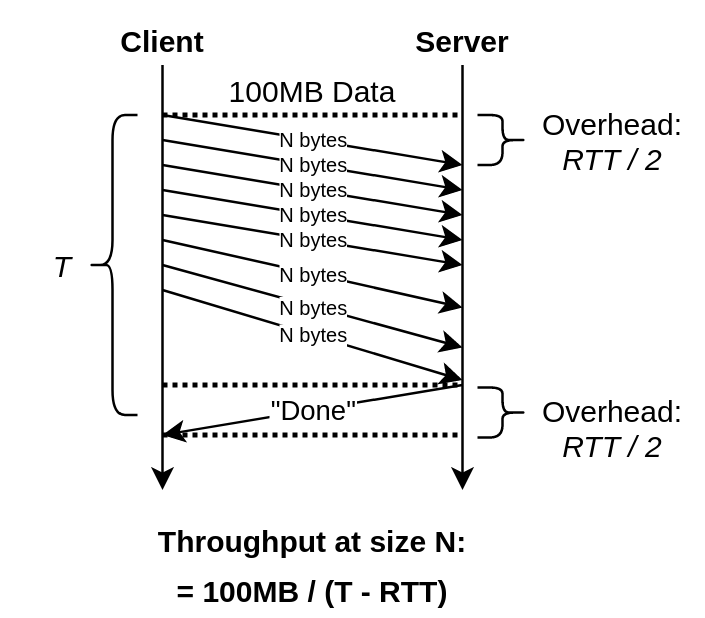

# RDMA Competition Exercise #1 - Throughput

**Key idea**: We measure the time of client transfering $N$ bytes of data to server, so the throughput between them is $N/(Time - Overhead)$. 




**A little more detail**: Every time we send $N$ bytes of data to server with different packet size, when server receives all of the data, it tells the client.  (Server replys "done" when it receives $N$ bytes of data.)
Notice: This will introduce unintended overhead, buf we fixed that: we'll measure the overhead first.

**Features: **

* **WARM-UP:** We do **warm-up rounds** to get OS ready first.
* **STABLE:** We keep measuring the **throughput until is stable** (varaiation < 1%).
* **OVERHEAD**: Since server sends an extra "done" message to client to indicate the ending of data transfer, it introduces overhead, which is exactly the half time of RTT. We takes it into consideration: we measures the RTT at first and **minus the overhad** when calculating throughput.


> Sizes/Byte: 1 2 4 8 16 32 64 128 256 512 1024 


## Build

```
make
```

## Run

Server side:

``` 
./server
```
Notice: The default port that server listen at is 6666, please check if the port is available.

Client side:

```
./client <server-ip-address>
```

## Example 

```
[user@login02 ex1-throughput]$ ./client 192.168.0.11
1   12.413690   Mbps
2   23.698684   Mbps
4   39.962892   Mbps
8   92.591493   Mbps
16  195.538049  Mbps
32  371.571475  Mbps
64  721.369048  Mbps
128 889.821203  Mbps
256 888.964672  Mbps
512 892.233194  Mbps
1024    890.618743  Mbps
```
